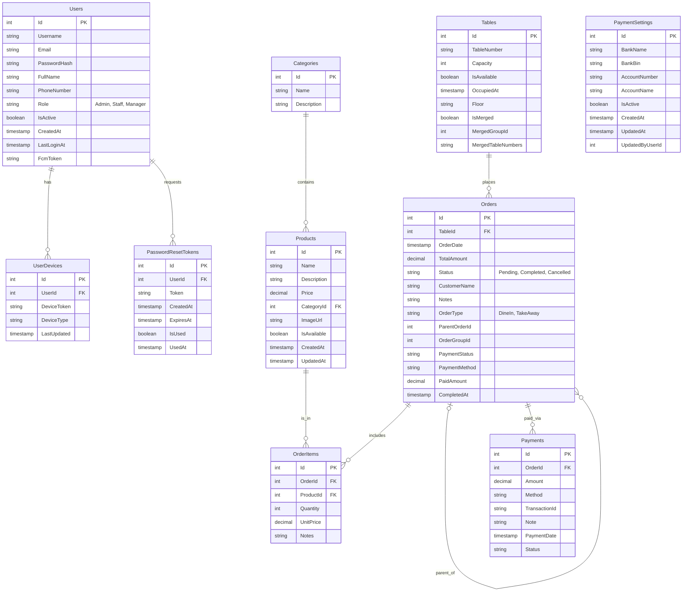

# Sơ đồ Cơ sở Dữ liệu (ER Diagram)

Dưới đây là sơ đồ thực thể - quan hệ (Entity Relationship Diagram) được xây dựng dựa trên file cấu trúc chuẩn `doc/database_schema_standard.sql`.

## Giải thích các Thực thể

### 1. Quản lý Người dùng (Authorization)
*   **Users**: Bảng trung tâm lưu trữ thông tin nhân viên, quản trị viên.
*   **UserDevices**: Lưu token thiết bị để gửi thông báo (Push Notification).
*   **PasswordResetTokens**: Quản lý quy trình quên mật khẩu.

### 2. Danh mục & Sản phẩm (Catalog)
*   **Categories**: Danh mục món ăn (Đồ ăn, Đồ uống, Khai vị...).
*   **Products**: Chi tiết món ăn, giá bán và hình ảnh.

### 3. Vận hành (Operations)
*   **Tables**: Quản lý bàn ăn, trạng thái (Trống/Có khách) và gộp bàn.
*   **Orders**: Đơn hàng, lưu trữ thông tin tổng quan, trạng thái thanh toán và loại đơn (Tại bàn/Mang về).
*   **OrderItems**: Chi tiết từng món trong đơn hàng.

### 4. Tài chính (Financial)
*   **Payments**: Lịch sử giao dịch thanh toán cho từng đơn hàng.
*   **PaymentSettings**: Cấu hình tài khoản ngân hàng để nhận tiền qua QR Code (VietQR).
