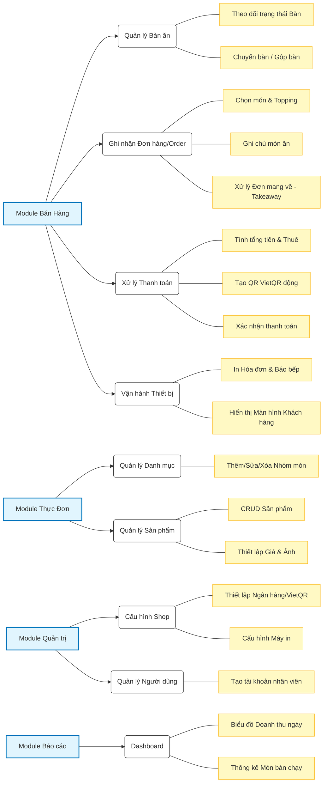
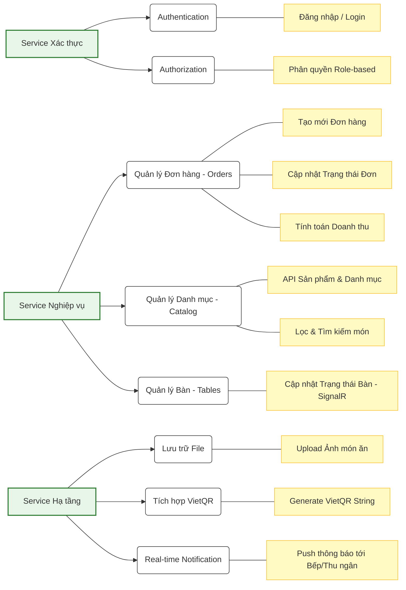

# Sơ đồ Phân rã Chức năng - Mức 2 (Level 2)
**Phân rã Chức năng Chi tiết (Detailed Functions)**

### 2.1. Phân rã Ứng dụng Desktop

```mermaid
graph LR
    %% -- STYLES --
    classDef module fill:#e1f5fe,stroke:#0277bd,stroke-width:2px;
    classDef func fill:#ffffff,stroke:#333,stroke-width:1px;
    classDef subfunc fill:#fff9c4,stroke:#fbc02d,stroke-width:1px;

    %% -- POS MODULE --
    POS[Module Bán Hàng]:::module
    POS --> P1(Quản lý Bàn ăn):::func
    POS --> P2(Ghi nhận Đơn hàng/Order):::func
    POS --> P3(Xử lý Thanh toán):::func
    POS --> P4(Vận hành Thiết bị):::func

    P1 --- P1_1[Theo dõi trạng thái Bàn]:::subfunc
    P1 --- P1_2[Chuyển bàn / Gộp bàn]:::subfunc

    P2 --- P2_1[Chọn món & Topping]:::subfunc
    P2 --- P2_2[Ghi chú món ăn]:::subfunc
    P2 --- P2_3[Xử lý Đơn mang về - Takeaway]:::subfunc

    P3 --- P3_1[Tính tổng tiền & Thuế]:::subfunc
    P3 --- P3_2[Tạo QR VietQR động]:::subfunc
    P3 --- P3_3[Xác nhận thanh toán]:::subfunc

    P4 --- P4_1[In Hóa đơn & Báo bếp]:::subfunc
    P4 --- P4_2[Hiển thị Màn hình Khách hàng]:::subfunc

    %% -- CATALOG MODULE --
    CAT[Module Thực Đơn]:::module
    CAT --> C1(Quản lý Danh mục):::func
    CAT --> C2(Quản lý Sản phẩm):::func
    
    C1 --- C1_1[Thêm/Sửa/Xóa Nhóm món]:::subfunc
    C2 --- C2_1[CRUD Sản phẩm]:::subfunc
    C2 --- C2_2[Thiết lập Giá & Ảnh]:::subfunc

    %% -- SYSTEM MODULE --
    SYS[Module Quản trị]:::module
    SYS --> S1(Cấu hình Shop):::func
    SYS --> S2(Quản lý Người dùng):::func
    
    S1 --- S1_1[Thiết lập Ngân hàng/VietQR]:::subfunc
    S1 --- S1_2[Cấu hình Máy in]:::subfunc
    S2 --- S2_1[Tạo tài khoản nhân viên]:::subfunc

    %% -- REPORT MODULE --
    RPT[Module Báo cáo]:::module
    RPT --> R1(Dashboard):::func
    
    R1 --- R1_1[Biểu đồ Doanh thu ngày]:::subfunc
    R1 --- R1_2[Thống kê Món bán chạy]:::subfunc
```

### 2.2. Phân rã Backend API

```mermaid
graph LR
    %% -- STYLES --
    classDef service fill:#e8f5e9,stroke:#2e7d32,stroke-width:2px;
    classDef endpoint fill:#ffffff,stroke:#333,stroke-width:1px;
    classDef logic fill:#fff9c4,stroke:#fbc02d,stroke-width:1px;

    %% -- AUTH SERVICE --
    AUTH[Service Xác thực]:::service
    AUTH --> Au1(Authentication):::endpoint
    AUTH --> Au2(Authorization):::endpoint
    
    Au1 --- Au1_1[Đăng nhập / Login]:::logic
    Au2 --- Au2_1[Phân quyền Role-based]:::logic

    %% -- BUSINESS SERVICE --
    BIZ[Service Nghiệp vụ]:::service
    BIZ --> B1(Quản lý Đơn hàng - Orders):::endpoint
    BIZ --> B2(Quản lý Danh mục - Catalog):::endpoint
    BIZ --> B3(Quản lý Bàn - Tables):::endpoint

    B1 --- B1_1[Tạo mới Đơn hàng]:::logic
    B1 --- B1_2[Cập nhật Trạng thái Đơn]:::logic
    B1 --- B1_3[Tính toán Doanh thu]:::logic

    B2 --- B2_1[API Sản phẩm & Danh mục]:::logic
    B2 --- B2_2[Lọc & Tìm kiếm món]:::logic

    B3 --- B3_1[Cập nhật Trạng thái Bàn - SignalR]:::logic

    %% -- INFRA SERVICE --
    INFRA[Service Hạ tầng]:::service
    INFRA --> I1(Lưu trữ File):::endpoint
    INFRA --> I2(Tích hợp VietQR):::endpoint
    INFRA --> I3(Real-time Notification):::endpoint

    I1 --- I1_1[Upload Ảnh món ăn]:::logic
    I2 --- I2_1[Generate VietQR String]:::logic
    I3 --- I3_1[Push thông báo tới Bếp/Thu ngân]:::logic
```
