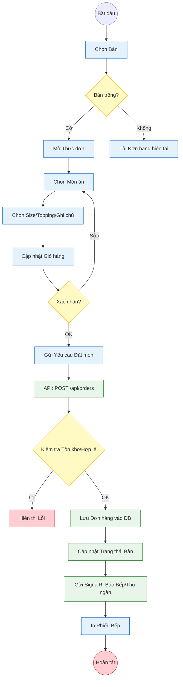
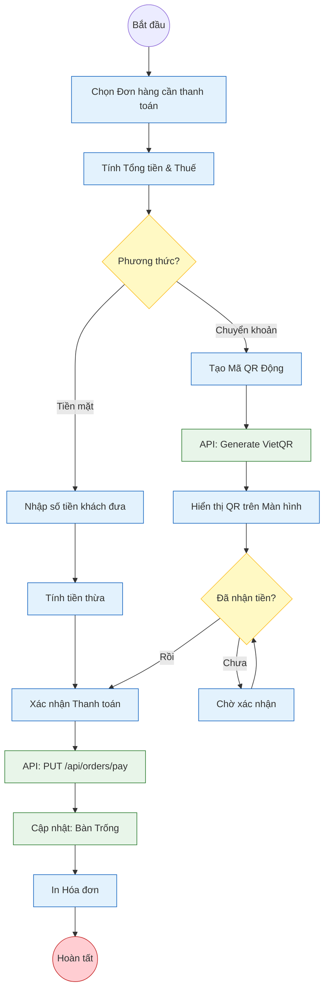
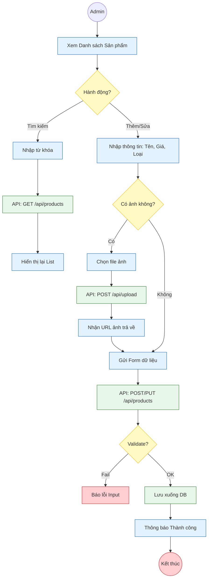

# Sơ đồ Phân rã Chức năng - Mức 3 (Level 3)
**Chi tiết Quy trình Xử lý (Process Logic & Data Flows)**

Ở mức này, chúng ta đi sâu vào logic xử lý của các chức năng nghiệp vụ quan trọng nhất. Đây là mức chi tiết quy trình (Process Level) cho các chức năng đã xác định ở Mức 2.

### 3.1. Chi tiết Chức năng: Xử lý Đơn hàng (Order Processing Flow)

Mô tả quy trình từ khi nhân viên chọn món đến khi đơn hàng được gửi xuống bếp.

### 3.2. Chi tiết Chức năng: Quy trình Thanh toán & VietQR (Payment Flow)

Mô tả quy trình tính tiền và thanh toán qua QR Code.

### 3.3. Chi tiết Chức năng: Quản trị Sản phẩm (Product Management Flow)

Chi tiết quy trình Thêm/Sửa sản phẩm bao gồm cả xử lý hình ảnh.

