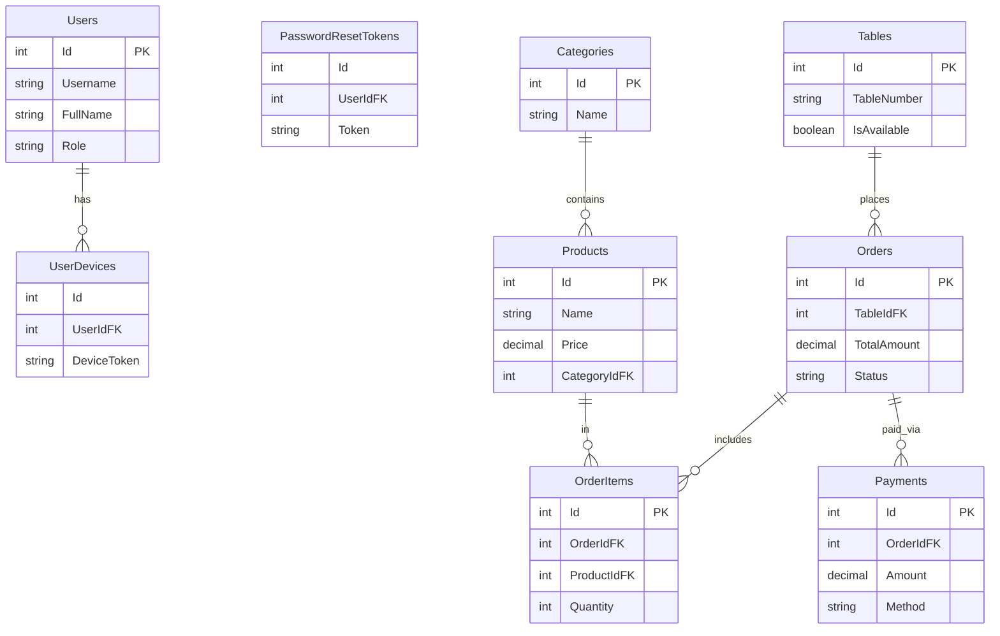

# BỘ GIÁO DỤC VÀ ĐÀO TẠO

# TRƯỜNG ĐẠI HỌC [TÊN TRƯỜNG CỦA BẠN]

# KHOA CÔNG NGHỆ THÔNG TIN

**BÁO CÁO BÀI TẬP LỚN**

**HỌC PHẦN: LẬP TRÌNH WINDOWS / CÔNG NGHỆ .NET**

**ĐỀ TÀI:**

# XÂY DỰNG HỆ THỐNG QUẢN LÝ NHÀ HÀNG (DESKTOP POS & API)

**Giảng viên hướng dẫn:** [Tên Giảng Viên]
**Sinh viên thực hiện:**

1. [Tên Sinh Viên 1] - [Mã SV]
2. [Tên Sinh Viên 2] - [Mã SV] (Nếu có)
   **Lớp:** [Tên Lớp]

**[Thành phố, Năm]**

## MỤC LỤC

**LỜI CẢM ƠN**
**DANH MỤC HÌNH ẢNH**
**DANH MỤC TỪ VIẾT TẮT**

**CHƯƠNG 1: TỔNG QUAN ĐỀ TÀI**
1.1. Lý do chọn đề tài
1.2. Mục tiêu của đề tài
1.3. Phạm vi nghiên cứu
1.4. Đối tượng sử dụng

**CHƯƠNG 2: CƠ SỞ LÝ THUYẾT VÀ CÔNG NGHỆ**
2.1. Nền tảng Microsoft .NET Core / .NET 6+
2.2. Kiến trúc RESTful Web API
2.3. Công nghệ WPF (Windows Presentation Foundation)
2.4. Mô hình thiết kế MVVM (Model-View-ViewModel)
2.5. Entity Framework Core (Code First)
2.6. Giao thức Real-time với SignalR
2.7. Hệ quản trị cơ sở dữ liệu PostgreSQL
2.8. Các thư viện và công cụ hỗ trợ

**CHƯƠNG 3: PHÂN TÍCH VÀ THIẾT KẾ HỆ THỐNG**
3.1. Phân tích yêu cầu chức năng
3.1.1. Quản trị hệ thống (Admin)
3.1.2. Nghiệp vụ Thu ngân (Cashier)
3.1.3. Nghiệp vụ Bếp (Kitchen Display)
3.2. Thiết kế Cơ sở dữ liệu (Database Schema)
3.2.1. Sơ đồ quan hệ thực thể (ERD)
3.2.2. Đặc tả chi tiết các bảng
3.3. Thiết kế Kiến trúc hệ thống
3.3.1. Mô hình Client-Server
3.3.2. Luồng dữ liệu (Data Flow)

**CHƯƠNG 4: TRIỂN KHAI XÂY DỰNG ỨNG DỤNG**
4.1. Xây dựng Backend (RestaurantPOS.API)
4.1.1. Cấu hình dự án và Middleware
4.1.2. Xây dựng Data Layer (DbContext & Migrations)
4.1.3. Triển khai Authentication (JWT)
4.1.4. Xử lý nghiệp vụ Đơn hàng và Thanh toán
4.1.5. Hub xử lý thời gian thực (SignalR)
4.2. Xây dựng Client (RestaurantPOS.Desktop)
4.2.1. Tổ chức cấu trúc MVVM
4.2.2. Xử lý Đăng nhập & Phân quyền
4.2.3. Quản lý Sơ đồ bàn ăn trực quan
4.2.4. Giao diện Đặt món và Tính tiền
4.2.5. Tích hợp in hóa đơn và Báo cáo

**CHƯƠNG 5: KẾT QUẢ ĐẠT ĐƯỢC**
5.1. Môi trường triển khai
5.2. Kết quả giao diện ứng dụng

**CHƯƠNG 6: KẾT LUẬN**
6.1. Kết luận chung
6.2. Hạn chế
6.3. Hướng phát triển

**TÀI LIỆU THAM KHẢO**

# CHƯƠNG 1: TỔNG QUAN ĐỀ TÀI

## 1.1. Lý do chọn đề tài

Trong lĩnh vực kinh doanh nhà hàng, tốc độ và sự chính xác là hai yếu tố then chốt. Các hệ thống POS (Point of Sale) truyền thống thường hoạt động offline, khó khăn trong việc đồng bộ dữ liệu hoặc mở rộng nhiều chi nhánh. Ngược lại, các hệ thống thuần web lại phụ thuộc quá nhiều vào trình duyệt và đôi khi không tận dụng được hết sức mạnh phần cứng để xử lý các tác vụ nặng như in ấn tức thời hay hiển thị đồ họa phức tạp mượt mà.

Đề tài **"Xây dựng hệ thống quản lý nhà hàng (Desktop POS & API)"** hướng tới việc kết hợp sức mạnh của ứng dụng Desktop (WPF) với tính linh hoạt của kiến trúc Microservices/API. Hệ thống đảm bảo nhân viên thu ngân có một công cụ làm việc hiệu năng cao, giao diện thân thiện, đồng thời dữ liệu được quản lý tập trung, bảo mật trên Server.

## 1.2. Mục tiêu của đề tài

* **Về mặt kiến thức:**
  * Làm chủ công nghệ **.NET 6/8** và ngôn ngữ  **C#** .
  * Hiểu sâu về kiến trúc **Client-Server** thông qua RESTful API.
  * Thành thạo kỹ thuật lập trình giao diện **WPF** theo mô hình  **MVVM** .
  * Ứng dụng các kỹ thuật nâng cao: **SignalR** (Real-time), **JWT** (Bảo mật), **EF Core** (Truy xuất dữ liệu).
* **Về mặt ứng dụng:**
  * Xây dựng phần mềm có khả năng quản lý toàn diện quy trình: Đặt bàn -> Gọi món -> Chế biến -> Thanh toán.
  * Hệ thống chạy ổn định, phản hồi nhanh, giao diện hiện đại (Material Design).

## 1.3. Phạm vi nghiên cứu

Đề tài tập trung xây dựng hai thành phần chính:

1. **RestaurantPOS.API (Backend):**
   * Cung cấp API cho toàn bộ nghiệp vụ.
   * Quản lý xác thực, phân quyền.
   * Lưu trữ dữ liệu tập trung  **(PostgreSQL)** .
   * Xử lý logic phức tạp: Thống kê, Tính toán hóa đơn.
2. **RestaurantPOS.Desktop (Client):**
   * Ứng dụng Windows dành cho Thu ngân và Quản lý.
   * Các chức năng: Quản lý bàn, Order món, In hóa đơn, Xem báo cáo.

## 1.4. Đối tượng sử dụng

* **Quản trị viên (Admin):** Cấu hình hệ thống, quản lý danh mục món ăn, nhân viên.
* **Thu ngân (Cashier):** Thực hiện các thao tác bán hàng hàng ngày, đóng/mở ca làm việc.
* **Đầu bếp (Chef):** Sử dụng màn hình Desktop (chế độ Kitchen View) để nhận đơn món cần chế biến.

# CHƯƠNG 2: CƠ SỞ LÝ THUYẾT VÀ CÔNG NGHỆ

## 2.1. Nền tảng Microsoft .NET Core / .NET 6+

.NET là nền tảng phát triển mã nguồn mở, đa nền tảng do Microsoft phát triển.

* **Hiệu năng cao:** Được tối ưu hóa cho các ứng dụng đám mây và xử lý lượng request lớn.
* **Thống nhất:** Cung cấp bộ thư viện chuẩn (BCL) phong phú cho cả Web và Desktop.
* **C# 10/11:** Sử dụng các tính năng ngôn ngữ mới như Global Usings, File-scoped namespaces giúp code gọn gàng hơn.

## 2.2. Kiến trúc RESTful Web API

**REST (Representational State Transfer)** là một kiểu kiến trúc phần mềm cho các hệ thống phân tán.

* **Stateless:** Server không lưu trạng thái của Client giữa các request, giúp dễ dàng mở rộng (scale).
* **Tài nguyên (Resources):** Mọi thứ đều là tài nguyên và được định danh bằng URI (Ví dụ: `/api/products`).
* **HTTP Verbs:** Sử dụng đúng chuẩn các phương thức HTTP: GET (lấy), POST (tạo), PUT (sửa), DELETE (xóa).

## 2.3. Công nghệ WPF (Windows Presentation Foundation)

WPF là hệ thống con đồ họa của .NET Framework (và .NET Core) để hiển thị giao diện người dùng trong các ứng dụng Windows.

* **XAML:** Ngôn ngữ đánh dấu dựa trên XML để định nghĩa giao diện, tách biệt hoàn toàn với logic xử lý (Code-behind).
* **Data Binding:** Cơ chế liên kết dữ liệu mạnh mẽ, tự động đồng bộ giữa giao diện và nguồn dữ liệu.
* **Vector Graphics:** Hỗ trợ độ phân giải cao (DPI-independent), giao diện sắc nét trên mọi màn hình.

## 2.4. Mô hình thiết kế MVVM (Model-View-ViewModel)

Dự án áp dụng triệt để mô hình MVVM để đảm bảo tính dễ bảo trì và kiểm thử.

* **Model:** Các lớp đối tượng nghiệp vụ (Entity), đại diện cho dữ liệu (Ví dụ: `Product`, `Order`).
* **View:** Giao diện người dùng (Window, UserControl), chỉ chịu trách nhiệm hiển thị.
* **ViewModel:** Trung gian xử lý logic. Nó "giấu" Model đi và cung cấp các thuộc tính, lệnh (Commands) để View trỏ vào (Binding). ViewModel không biết gì về View (không tham chiếu đến UI controls).

## 2.5. Entity Framework Core (Code First)

ORM (Object-Relational Mapper) giúp thao tác với CSDL bằng các đối tượng C#.

* **Code First:** Định nghĩa các Class C# trước, sau đó EF Core sẽ tự động sinh ra database schema thông qua Migration.
* **LINQ (Language Integrated Query):** Viết truy vấn dữ liệu bằng cú pháp C# mạnh mẽ, an toàn kiểu dữ liệu.

## 2.6. Giao thức Real-time với SignalR

SignalR là thư viện cho phép server đẩy nội dung đến các client đang kết nối ngay lập tức (Push notification).

* Trong dự án, khi một đơn hàng được tạo, SignalR Hub sẽ phát sự kiện `ReceiveOrder` đến tất cả các máy Desktop đang mở để cập nhật trạng thái bàn ăn và màn hình bếp mà không cần người dùng nhấn F5.

## 2.7. Hệ quản trị cơ sở dữ liệu PostgreSQL

PostgreSQL là một hệ quản trị cơ sở dữ liệu quan hệ đối tượng (ORDBMS) mã nguồn mở mạnh mẽ.

* **Ưu điểm:** Độ tin cậy cao, tuân thủ chuẩn SQL, hỗ trợ tốt các kiểu dữ liệu phức tạp (JSONB) và khả năng mở rộng.
* **Tương thích .NET:** Sử dụng provider `Npgsql` để kết nối hiệu quả với Entity Framework Core.

## 2.8. Các thư viện và công cụ hỗ trợ

Hệ thống sử dụng các thư viện (NuGet packages) sau để tăng tốc độ phát triển và đảm bảo chất lượng:

**Backend (API):**

* `Npgsql.EntityFrameworkCore.PostgreSQL`: Provider kết nối PostgreSQL cho EF Core.
* `Microsoft.AspNetCore.Authentication.JwtBearer`: Xử lý xác thực Token JWT.
* `Swashbuckle.AspNetCore`: Tự động sinh tài liệu API (Swagger UI).
* `BCrypt.Net-Next`: Mã hóa mật khẩu an toàn (Hashing).
* `FirebaseAdmin`: Gửi thông báo đẩy (Push Notification) tới thiết bị di động.

**Frontend (WPF Desktop):**

* `MaterialDesignThemes`: Bộ thư viện giao diện Material Design hiện đại cho WPF.
* `MaterialDesignColors`: Quản lý bảng màu và theme (Dark/Light mode).
* `LiveCharts.Wpf`: Vẽ biểu đồ thống kê doanh thu trực quan.
* `Microsoft.AspNetCore.SignalR.Client`: Client thư viện để kết nối thời gian thực với Server.
* `Newtonsoft.Json`: Xử lý chuyển đổi JSON (Serialization/Deserialization).

# CHƯƠNG 3: PHÂN TÍCH VÀ THIẾT KẾ HỆ THỐNG

## 3.1. Phân tích yêu cầu chức năng

### Sơ đồ Phân rã Chức năng (Functional Decomposition)

```mermaid
graph TD
    System[RestaurantPOS System] --> Desktop[Desktop App]
    System --> API[Backend API]

    %% Desktop
    Desktop --> D_POS[Bán Hàng (POS)]
    Desktop --> D_Admin[Quản trị Hệ thống]
    Desktop --> D_Report[Báo cáo]

    D_POS --> P_Table[Quản lý Bàn]
    D_POS --> P_Order[Gọi món]
    D_POS --> P_Pay[Thanh toán]

    %% API
    API --> A_Auth[Xác thực]
    API --> A_Biz[Xử lý Nghiệp vụ]
    API --> A_Infra[Hạ tầng]
```

### Sơ đồ Use Case Tổng quát

```mermaid
usecaseDiagram
    actor Staff as "Nhân viên Thu ngân"
    actor Manager as "Quản lý / Admin"

    package "RestaurantPOS" {
        usecase "Đăng nhập" as UC1
        usecase "Quản lý Bàn" as UC2
        usecase "Gọi món" as UC3
        usecase "Thanh toán" as UC4
        usecase "Quản lý Thực đơn" as UC5
        usecase "Xem Báo cáo" as UC6
    }

    Staff --> UC1
    Staff --> UC2
    Staff --> UC3
    Staff --> UC4

    Manager --> UC1
    Manager --> UC5
    Manager --> UC6
    Manager --|> Staff
```


### 3.1.1. Quản trị hệ thống (Admin)

* **Đăng nhập hệ thống:** Bảo mật bằng Token.
* **Quản lý Danh mục (Categories):** Phân loại món ăn (Đồ uống, Khai vị, Món chính...).
* **Quản lý Thực đơn (Products):**
  * Thông tin: Tên, Giá, Ảnh đại diện, Mô tả.
  * Trạng thái: Còn hàng/Hết hàng (để chặn order món đã hết nguyên liệu).
* **Quản lý Bàn (Tables):** Thiết lập sơ đồ nhà hàng, số lượng ghế.
* **Báo cáo doanh thu:** Xem biểu đồ doanh thu theo ngày, tuần, tháng. Xuất báo cáo ra Excel/PDF.

### 3.1.2. Nghiệp vụ Thu ngân (Cashier)

* **Dashboard:** Xem tổng quan trạng thái tất cả các bàn (Trống - Xanh, Có khách - Đỏ).
* **Mở bàn/Đặt món:**
  * Chọn bàn -> Chọn món từ thực đơn.
  * Thêm ghi chú cho món (Ví dụ: "Không hành", "Ít đá").
  * Cập nhật số lượng, hủy món.
* **Thanh toán:**
  * Xem hóa đơn tạm tính.
  * Chọn phương thức thanh toán (Tiền mặt, Chuyển khoản VietQR).
  * In hóa đơn (Receipt Printing).
  * Kết thúc đơn hàng, trả bàn về trạng thái Trống.

### 3.1.3. Nghiệp vụ Bếp (Kitchen Display)

* Nhận thông báo Real-time khi có món mới được order.
* Hiển thị danh sách món cần làm theo thứ tự thời gian.
* Đánh dấu món "Đã xong" để phục vụ mang ra.

## 3.2. Thiết kế Cơ sở dữ liệu (Database Schema)

Hệ thống sử dụng **PostgreSQL** với cấu trúc dữ liệu được chuẩn hóa như sau:

### 3.2.1. Sơ đồ thực thể

### 3.2.1. Sơ đồ quan hệ thực thể (ERD)




### 3.2.2. Đặc tả chi tiết các bảng

**1. Bảng `Users` (Người dùng)**
Quản lý thông tin tài khoản và nhân viên.

* `Id` (PK, Integer, Identity): Khóa chính tự tăng.
* `Username` (Varchar 100): Tên đăng nhập.
* `Email` (Varchar 200): Email xác thực.
* `PasswordHash` (Text): Mật khẩu đã băm (Hash).
* `FullName` (Varchar 100): Họ tên đầy đủ.
* `Role` (Varchar 20): Vai trò (Admin, Staff, Manager).
* `IsActive` (Boolean): Trạng thái kích hoạt.
* `FcmToken`: Token dùng cho Firebase Cloud Messaging.

**2. Bảng `Categories` (Danh mục)**

* `Id` (PK, Integer): Mã danh mục.
* `Name` (Varchar 50): Tên nhóm món (VD: Đồ uống, Món chính).
* `Description`: Mô tả ngắn.

**3. Bảng `Products` (Món ăn/Sản phẩm)**

* `Id` (PK, Integer): Mã món ăn.
* `Name` (Varchar 100): Tên món.
* `Price` (Numeric 18,2): Đơn giá bán.
* `CategoryId` (FK): Khóa ngoại tham chiếu đến Categories.
* `ImageUrl`: Đường dẫn ảnh món ăn.
* `IsAvailable`: Trạng thái (Còn/Hết).

**4. Bảng `Tables` (Bàn ăn)**

* `Id` (PK, Integer): Mã định danh.
* `TableNumber` (Varchar 20): Số bàn hiển thị (VD: Bàn 1, VIP A).
* `Capacity`: Sức chứa.
* `IsAvailable`: Trạng thái bàn trống/có khách.
* `OccupiedAt`: Thời gian bắt đầu có khách.
* `Floor`: Tầng/Khu vực.
* `IsMerged`, `MergedGroupId`: Hỗ trợ tính năng gộp bàn.

**5. Bảng `Orders` (Đơn hàng)**

* `Id` (PK, Integer): Mã đơn hàng.
* `TableId` (FK): Đơn hàng thuộc bàn nào.
* `OrderDate`: Thời gian tạo đơn.
* `TotalAmount`: Tổng tiền đơn hàng.
* `Status`: Trạng thái (Pending - Đang chờ, Completed - Hoàn thành, Cancelled - Hủy).
* `PaymentStatus`: Trạng thái thanh toán (Unpaid/Paid).
* `OrderType`: Loại đơn (DineIn - Tại chỗ, TakeAway - Mang về).

**6. Bảng `OrderItems` (Chi tiết đơn hàng)**

* `Id` (PK, Integer).
* `OrderId` (FK): Thuộc đơn hàng nào.
* `ProductId` (FK): Món ăn nào.
* `Quantity`: Số lượng.
* `UnitPrice`: Giá bán tại thời điểm đặt (để lưu lịch sử giá nếu giá gốc thay đổi).
* `Notes`: Ghi chú món (VD: Không cay).

**7. Bảng `Payments` (Giao dịch thanh toán)**

* `Id` (PK, Integer).
* `OrderId` (FK): Thanh toán cho đơn nào.
* `Amount`: Số tiền thanh toán.
* `Method`: Phương thức (Cash, Transfer).
* `TransactionId`: Mã giao dịch ngân hàng (nếu có).
* `Status`: Trạng thái giao dịch.

**8. Bảng `PaymentSettings` (Cấu hình thanh toán)**

* `Id` (PK): Mã cấu hình.
* `BankName`, `BankBin`: Thông tin ngân hàng nhận tiền.
* `AccountNumber`, `AccountName`: Số tài khoản và Tên chủ tài khoản.
* `IsActive`: Đánh dấu tài khoản đang được sử dụng để nhận tiền.

**9. Bảng phụ trợ khác**

* `UserDevices`: Quản lý thiết bị đăng nhập của nhân viên.
* `PasswordResetTokens`: Quản lý token khôi phục mật khẩu.

# CHƯƠNG 4: TRIỂN KHAI XÂY DỰNG ỨNG DỤNG

## 4.1. Xây dựng Backend (RestaurantPOS.API)

### 4.1.1. Cấu hình dự án (Program.cs)

Thiết lập DI Container, kết nối Database PostgreSQL và cấu hình SignalR, JWT Authentication.

```
// File: RestaurantPOS.API/Program.cs
var builder = WebApplication.CreateBuilder(args);

// 1. Kết nối PostgreSQL (Sử dụng Npgsql)
builder.Services.AddDbContext<ApplicationDbContext>(options =>
    options.UseNpgsql(builder.Configuration.GetConnectionString("DefaultConnection")));

// 2. Cấu hình Identity (User/Role)
builder.Services.AddIdentity<User, IdentityRole>()
    .AddEntityFrameworkStores<ApplicationDbContext>()
    .AddDefaultTokenProviders();

// 3. Cấu hình JWT Authentication
builder.Services.AddAuthentication(options => {
    options.DefaultAuthenticateScheme = JwtBearerDefaults.AuthenticationScheme;
    options.DefaultChallengeScheme = JwtBearerDefaults.AuthenticationScheme;
})
.AddJwtBearer(options => {
    options.TokenValidationParameters = new TokenValidationParameters {
        ValidateIssuer = true,
        ValidateAudience = true,
        ValidateLifetime = true,
        ValidateIssuerSigningKey = true,
        ValidIssuer = builder.Configuration["Jwt:Issuer"],
        ValidAudience = builder.Configuration["Jwt:Audience"],
        IssuerSigningKey = new SymmetricSecurityKey(Encoding.UTF8.GetBytes(builder.Configuration["Jwt:Key"]))
    };
});

// 4. Đăng ký SignalR
builder.Services.AddSignalR();

// 5. Đăng ký các Service (Business Logic)
builder.Services.AddScoped<IOrderService, OrderService>();
builder.Services.AddScoped<IAuthService, AuthService>();
// ...
```

### 4.1.2. Xử lý nghiệp vụ Đơn hàng (OrderService)

Service này xử lý logic cốt lõi: Tạo đơn, tính tiền, và thông báo thời gian thực.

```
// File: RestaurantPOS.API/Services/OrderService.cs
public class OrderService : IOrderService
{
    private readonly ApplicationDbContext _context;
    private readonly IHubContext<RestaurantHub> _hubContext;

    public OrderService(ApplicationDbContext context, IHubContext<RestaurantHub> hubContext)
    {
        _context = context;
        _hubContext = hubContext;
    }

    public async Task<Order> CreateOrderAsync(CreateOrderDto dto)
    {
        // 1. Kiểm tra bàn
        var table = await _context.Tables.FindAsync(dto.TableId);
        if (table == null) throw new Exception("Bàn không tồn tại");

        // 2. Cập nhật trạng thái bàn -> Có khách
        table.Status = TableStatus.Occupied;

        // 3. Tạo Order
        var order = new Order
        {
            Id = Guid.NewGuid(),
            TableId = dto.TableId,
            OrderDate = DateTime.Now, // PostgreSQL lưu Timestamp
            Status = OrderStatus.Pending,
            TotalAmount = 0
        };

        // 4. Thêm món ăn và tính tiền
        foreach (var item in dto.Items)
        {
            var product = await _context.Products.FindAsync(item.ProductId);
            var orderItem = new OrderItem
            {
                OrderId = order.Id,
                ProductId = item.ProductId,
                Quantity = item.Quantity,
                Price = product.Price, // Lưu giá tại thời điểm đặt
                Note = item.Note
            };
            order.TotalAmount += orderItem.Price * orderItem.Quantity;
            _context.OrderItems.Add(orderItem);
        }

        _context.Orders.Add(order);
        await _context.SaveChangesAsync();

        // 5. Real-time: Bắn tin hiệu cho các Client khác (Bếp, Thu ngân khác)
        await _hubContext.Clients.All.SendAsync("TableUpdated", table.Id, TableStatus.Occupied);
        await _hubContext.Clients.All.SendAsync("NewOrderCreated", order);

        return order;
    }
}
```

### 4.1.3. API Controller (OrdersController)

Expose các endpoint ra ngoài cho Desktop App gọi.

```
[Route("api/[controller]")]
[ApiController]
[Authorize] // Yêu cầu đăng nhập mới được gọi
public class OrdersController : ControllerBase
{
    private readonly IOrderService _orderService;

    public OrdersController(IOrderService orderService)
    {
        _orderService = orderService;
    }

    [HttpPost]
    public async Task<IActionResult> CreateOrder([FromBody] CreateOrderDto dto)
    {
        try
        {
            var order = await _orderService.CreateOrderAsync(dto);
            return Ok(order);
        }
        catch (Exception ex)
        {
            return BadRequest(new { message = ex.Message });
        }
    }
}
```

## 4.2. Xây dựng Client (RestaurantPOS.Desktop)

### 4.2.1. Cấu trúc MVVM trong Solution

* **Views:** Chứa các file `.xaml` như `LoginWindow.xaml`, `MainWindow.xaml`, `OrdersView.xaml`.
* **ViewModels:** Chứa logic điều khiển như `LoginViewModel.cs`, `MainViewModel.cs`, `OrdersViewModel.cs`.
* **Models:** Chứa các class dữ liệu ánh xạ từ API.
* **Services:** Chứa các class gọi API (`OrderService`, `AuthService`).

### 4.2.2. Xử lý Đăng nhập (AuthService & LoginViewModel)

Sử dụng `HttpClient` để gửi request lên API lấy Token.

```
// File: RestaurantPOS.Desktop/Services/AuthService.cs
public async Task<string> LoginAsync(string username, string password)
{
    var loginData = new { Username = username, Password = password };
    var content = new StringContent(JsonConvert.SerializeObject(loginData), Encoding.UTF8, "application/json");
  
    var response = await _httpClient.PostAsync("api/auth/login", content);
  
    if (response.IsSuccessStatusCode)
    {
        var result = await response.Content.ReadAsStringAsync();
        var tokenObj = JsonConvert.DeserializeObject<TokenResponse>(result);
        // Lưu token vào session hoặc file config tạm
        return tokenObj.Token;
    }
    return null;
}
```

### 4.2.3. Hiển thị Sơ đồ bàn (Data Binding & Converter)

Sử dụng `ItemsControl` trong WPF để bind danh sách bàn ăn. Sử dụng Converter để chuyển đổi trạng thái bàn thành màu sắc.

**TableStatusToColorConverter.cs:**

```
public class TableStatusToColorConverter : IValueConverter
{
    public object Convert(object value, Type targetType, object parameter, CultureInfo culture)
    {
        var status = (TableStatus)value;
        return status switch
        {
            TableStatus.Available => Brushes.LightGreen, // Bàn trống màu xanh
            TableStatus.Occupied => Brushes.IndianRed,   // Có khách màu đỏ
            TableStatus.Reserved => Brushes.Orange,      // Đặt trước màu cam
            _ => Brushes.Gray
        };
    }
    // ... ConvertBack implementation
}
```

**XAML (TablesView.xaml):**

```
<ItemsControl ItemsSource="{Binding Tables}">
    <ItemsControl.ItemTemplate>
        <DataTemplate>
            <Button Command="{Binding DataContext.SelectTableCommand, RelativeSource={RelativeSource AncestorType=UserControl}}"
                    CommandParameter="{Binding}"
                    Background="{Binding Status, Converter={StaticResource TableStatusToColorConverter}}"
                    Width="100" Height="100" Margin="10">
                <StackPanel>
                    <materialDesign:PackIcon Kind="TableFurniture" Width="40" Height="40"/>
                    <TextBlock Text="{Binding Name}" HorizontalAlignment="Center" FontWeight="Bold"/>
                </StackPanel>
            </Button>
        </DataTemplate>
    </ItemsControl.ItemTemplate>
</ItemsControl>
```

### 4.2.4. SignalR Service trên Desktop

Client cần lắng nghe sự kiện từ Server để cập nhật giao diện mà không cần người dùng thao tác.

```
// File: RestaurantPOS.Desktop/Services/SignalRService.cs
public class SignalRService
{
    private HubConnection _connection;

    public event Action<int, int> OnTableStatusChanged;

    public async Task ConnectAsync(string token)
    {
        _connection = new HubConnectionBuilder()
            .WithUrl("https://localhost:7000/restaurantHub", options =>
            {
                options.AccessTokenProvider = () => Task.FromResult(token);
            })
            .WithAutomaticReconnect()
            .Build();

        // Lắng nghe sự kiện từ Server
        _connection.On<int, int>("TableUpdated", (tableId, status) =>
        {
            // Bắn event ra cho ViewModel xử lý
            OnTableStatusChanged?.Invoke(tableId, status);
        });

        await _connection.StartAsync();
    }
}
```

### 4.2.5. Tích hợp VietQR để thanh toán

Tạo mã QR động dựa trên số tiền hóa đơn để khách hàng quét.

```
// Trong PaymentViewModel.cs
public void GenerateQrCode()
{
    // Cấu trúc QuickLink của VietQR
    // [https://img.vietqr.io/image/](https://img.vietqr.io/image/){bankId}-{accountNo}-{template}.png?amount={amount}&addInfo={content}
    string bankId = "MB";
    string accountNo = "0123456789";
    string template = "compact";
    double amount = CurrentOrder.TotalAmount;
    string info = $"TT Don {CurrentOrder.Id}";

    QrCodeImageUrl = $"[https://img.vietqr.io/image/](https://img.vietqr.io/image/){bankId}-{accountNo}-{template}.png?amount={amount}&addInfo={info}";
}
```

# CHƯƠNG 5: KẾT QUẢ ĐẠT ĐƯỢC

## 5.1. Môi trường triển khai

* **Server:** PC chạy Windows 11,  **PostgreSQL 15+** , IIS Express/Kestrel.
* **Client:** Laptop chạy Windows 10/11, độ phân giải màn hình Full HD.

## 5.2. Kết quả giao diện ứng dụng

**(Phần này sinh viên chụp ảnh màn hình ứng dụng đang chạy để chèn vào)**

* **Hình 5.1: Màn hình Đăng nhập:** Giao diện tối giản, sử dụng Material Design, có nút "Ghi nhớ đăng nhập".
* **Hình 5.2: Dashboard Sơ đồ bàn:** Hiển thị lưới các bàn ăn. Bàn có khách hiển thị màu đỏ nổi bật.
* **Hình 5.3: Giao diện Gọi món:** Danh sách thực đơn bên trái, hóa đơn tạm tính bên phải. Có chức năng tìm kiếm món nhanh.
* **Hình 5.4: Thanh toán và Mã QR:** Hiển thị mã QR VietQR được tạo tự động đúng với số tiền cần thanh toán.

# CHƯƠNG 6: KẾT LUẬN

## 6.1. Kết luận chung

Dự án đã xây dựng thành công một hệ thống quản lý nhà hàng hiện đại, tập trung vào trải nghiệm người dùng trên nền tảng Desktop.

* **Kiến trúc:** Phân tách rõ ràng giữa Backend (API) và Frontend (WPF Desktop) giúp hệ thống dễ bảo trì và nâng cấp.
* **Công nghệ:** Áp dụng thành công các công nghệ tiên tiến của hệ sinh thái .NET như EF Core với  **PostgreSQL** , SignalR, WPF Material Design.
* **Chức năng:** Đáp ứng đầy đủ các nghiệp vụ cơ bản của một nhà hàng: Quản lý bàn, gọi món, thanh toán, báo cáo.

## 6.2. Hạn chế

* Chưa hỗ trợ chế độ Offline (mất mạng không thể bán hàng).
* Chức năng in hóa đơn mới chỉ dừng lại ở xem trước (Preview), chưa kết nối trực tiếp driver máy in nhiệt.
* Báo cáo thống kê còn đơn giản, chưa có các phân tích sâu (AI dự đoán doanh thu).

## 6.3. Hướng phát triển

* **Offline Support:** Sử dụng SQLite tại Client để lưu dữ liệu tạm khi mất mạng và đồng bộ lại Server khi có mạng (Sync Services).
* **Mở rộng nền tảng:** Phát triển thêm Mobile App (đã có trong kế hoạch nhưng chưa hoàn thiện trong phạm vi bài tập này).
* **Tích hợp phần cứng:** Kết nối trực tiếp ngăn kéo đựng tiền (Cash Drawer) và máy in bếp.

# TÀI LIỆU THAM KHẢO

1. Microsoft Documentation. "ASP.NET Core Web API". [Online].
2. Npgsql Documentation. "Npgsql Entity Framework Core Provider". [Online].
3. Microsoft Documentation. "WPF Architecture & Data Binding". [Online].
4. Material Design In XAML Toolkit. "Wiki & Demo".
5. VietQR. "API Documentation for generating QR Codes".

**NHẬN XÉT CỦA GIẢNG VIÊN**
....................................................................................................................................................................
....................................................................................................................................................................
....................................................................................................................................................................
....................................................................................................................................................................

**ĐIỂM SỐ:** ...........................
